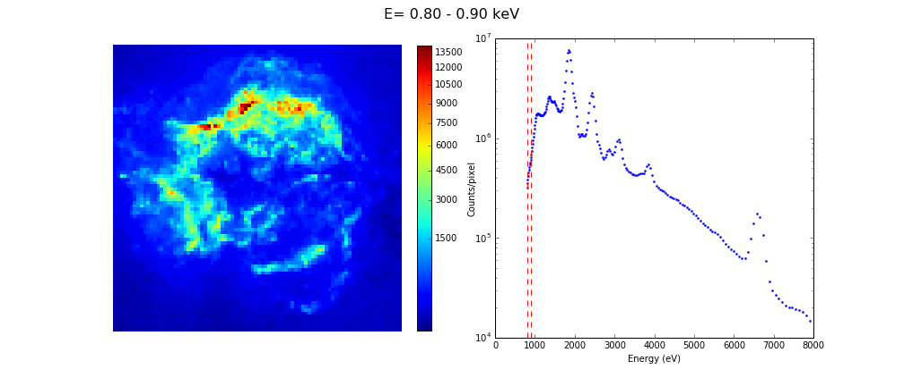
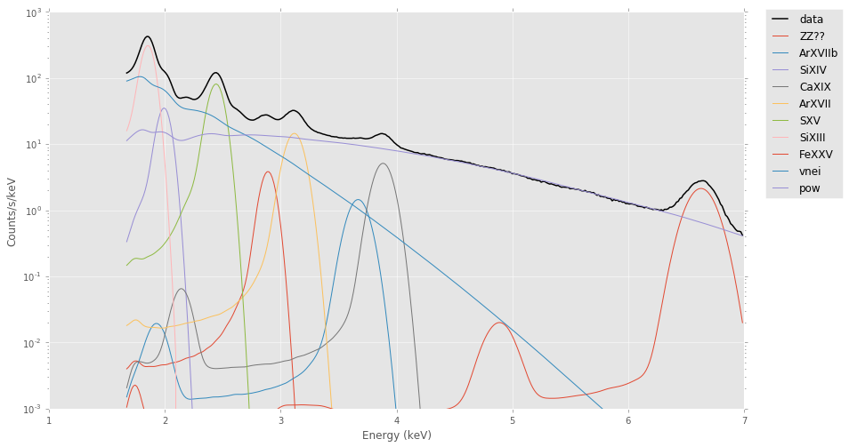

# BHESS
Separating spectral components for high energy astronomy.

The accepted version of the methodology paper can be found on arxiv [here](https://arxiv.org/abs/1905.10175).

The animation belows shows energy slices of a data cube (RA,DEC,E) generated from several deep observations of the CasA SNR as seen by the Chandra X-ray telescope:

The X-ray emission is composed of several components like bremsstrahlung (from the hot gas), synchrotron emission (from particles accelerated at the shock) and a population of emission lines from Si, Mg, Ar, Fe, etc.

The plot below shows a spectrum from the entire SNR and a simple best-fit model.

Producing a map of the emission from individuals lines can be difficult because of components mixing:
- several lines are very nearby in energy
- most lines are dominated by continuum emission and its base level cannot be simply derived from the image

We here propose to use the method of blind (or semi-blind) source separation to separate the spectral components in X-rays. 
In particular we want to apply the recent methods (LGMCA ; Local-Generalized Morphological Component Analysis) developped by the [CosmoStat](http://www.cosmostat.org/) group at CEA that have been succesfuly applied to Planck to separated the CMB map from the foregrounds emissions (see [here](http://www.cosmostat.org/research/cmb/planck_wpr2/) for more details).
